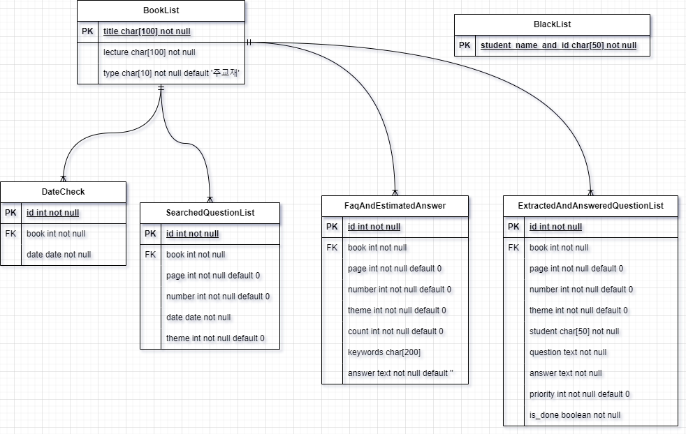

## 프로젝트 소개
메가스터디 질문 게시판에 올라와 있는 질문들을 취합하고 분석하여 동일한 질문에 들어가는 시간 낭비를 최소화하기 위한 프로젝트

- 프로젝트 기간: 23.05 ~ 23.08
- 프로젝트 기술 스택: Python `Django`, `Selenium`
   - python `selenium` 라이브러리와 `django` 프레임워크를 통해 `python`을 빠르게 배워보기 위함

## 프로젝트 기능
1. 답변 완료 **질문 정보 취합, 분석 및 질문 빈도수 저장**
2. 답변 완료 질문 빈도수별 키워드 설정 및 예상 답변 저장
3. 답변 가능 **질문 추출** 및 **자동 답변**

## ERD

## 도전 과제 및 해결책
- 데이터셋의 수집 및 전처리 과정 경험
- 딥러닝 프로젝트에서 데이터를 효과적으로 처리하고, 분석하는 역할을 기대
- 오류 처리, 리팩토링 필요성 느낌